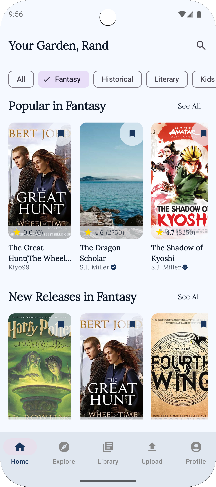
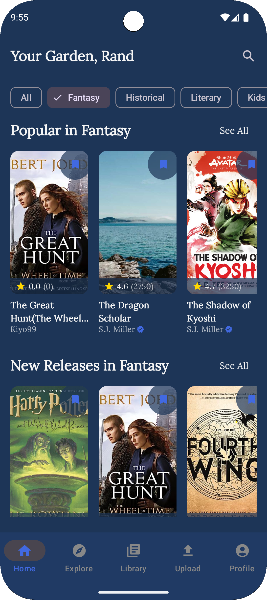

# TaleGarden Landing Page

A modern, responsive landing page for TaleGarden - an immersive e-reading application that connects independent authors with readers through a sophisticated reading experience enhanced by Spotify integration.

## 🌟 Features

- **Responsive Design**: Fully responsive layout that works seamlessly on mobile, tablet, and desktop devices
- **Light/Dark Mode**: Dynamic theme switching with persistent user preference
- **Modern UI**: Built with Tailwind CSS and Next.js 14 for a polished user experience
- **Optimized Images**: Automatic theme-based image switching
- **Performance Focused**: Optimized for Core Web Vitals and SEO
- **Accessibility**: Designed with accessibility in mind

## 📸 Screenshots

| Light Mode | Dark Mode |
|------------|-----------|
|  |  |

## 🚀 Technologies

- [Next.js 14](https://nextjs.org/) - React framework with App Router
- [TypeScript](https://www.typescriptlang.org/) - Type safety
- [Tailwind CSS](https://tailwindcss.com/) - Utility-first CSS framework
- [Lora Font](https://fonts.google.com/specimen/Lora) - Elegant serif typeface

## 🎨 Customization

### Colors

The primary color scheme uses Tailwind's green palette as the primary accent with appropriate dark mode alternatives. You can modify the color scheme in the components by changing the color classes.

### Images

Replace the images in the `public` folder with your own screenshots. Make sure to keep the naming convention:
- `feature_light.png` - Light mode version
- `feature_dark.png` - Dark mode version

## 📱 Mobile App Integration

This landing page is designed to promote the TaleGarden mobile app. The download buttons can be configured to point to the App Store and Google Play Store once the app is published.

## 🔄 Theme Switching

The theme switching is implemented using a context provider that persists the user's preference in local storage. The theme switch component is accessible from any page of the application.

## 🤝 Acknowledgements

- [Next.js](https://nextjs.org/)
- [Tailwind CSS](https://tailwindcss.com/)
- [Google Fonts](https://fonts.google.com/)
- [Vercel](https://vercel.com/) for hosting

---

Created with ❤️ by [Godsfavour Kio](https://godsfavourkio.com)
